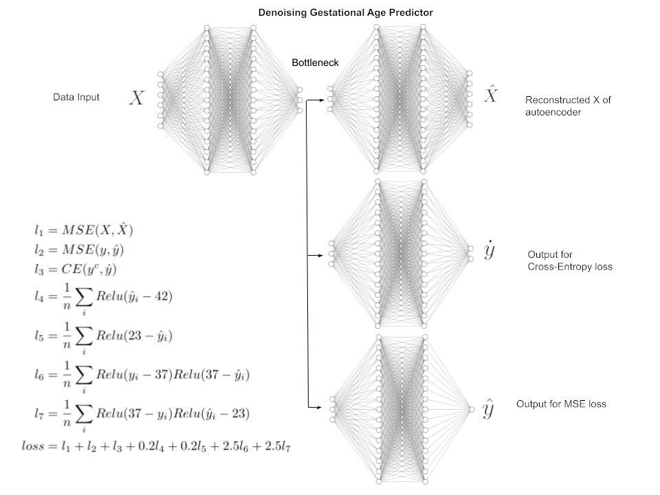

## Key Considerations for the Design of gestation Age Net
1. The data contains many missing entries. 
2. The classification and regression problem is highly imbalanced
3. The data itself is highly noisy
4. The data simultaneously contains two distinct types of labels; continuous and discrete labels.
5. How can we design an algorithm that simultaneoulsy take advantage of both label types?
6. How do we take advantage of the prior that gestational ages should be between the range of 22 to 43? 
7. How do we minimize false positive error (type 1 or α)?
8. How do we minimize false negative error (type 2 or β)?
9. How do we simultaneously optimize Precision, Recall, and AUC?

## Solution to the key considerations
1. The data contains many missing entries. 
    + Use denoising autoencoder as input at 40% potential missing values
    + Use Bayesian Ridge Regression to "iteratively" predict the missing value using all other existing values
2. The classification and regression problem is highly imbalanced
    + oversampling, smote
3. The data itself is highly noisy
    + An autoencoder structure allows us to filter out the noise while retaining the core information
4. The data simultaneously contains two distinct types of labels; continuous and discrete labels. How can we design an algorithm that simultaneoulsy take advantage of both label types?
    + We can let the bottleneck of an autoencoder to connect to 2 separate networks: one for regression objective and one for classification objective. And optimize both objectives simultaneously. 
5. How do we take advantage of the prior that gestational ages should be between the range of 22 to 43? 
    + With the following two constrains
    $$\quad l_1 = \sum_i^N relu(y_i - 43)$$
    $$\quad l_2 = \sum_i^N relu(22 - y_i)$$
6. How do we minimize false positive error (type 1 or α)?
    + With the following constrain
    $$\quad l_3 = \sum_i^N relu(y_i - 37) relu(37 - \hat{y}_i)$$
7. How do we minimize false negative error (type 2 or β)?
    + With the following constrain
    $$\quad l_4 = \sum_i^N relu(37 - y_i) relu(\hat{y}_i - 37)$$
8. How do we simultaneously optimize Precision, Recall, and AUC? 
    + This is resolved by answering questions 6 and 7. 

## Resulting Network Structure Gestational Agre Predictor

